<!--
  PEDRINSCRK PROFILE
  Premium, animation-heavy GitHub profile.
  Private/company work is intentionally described at a high level.
-->

  

  <a href="#about--sobre">ABOUT</a>
  &nbsp;&nbsp;·&nbsp;&nbsp;
  <a href="#live-data-architecture">DATA FLOW</a>
  &nbsp;&nbsp;·&nbsp;&nbsp;
  <a href="#what-i-build--o-que-eu-construo">WORK</a>
  &nbsp;&nbsp;·&nbsp;&nbsp;
  <a href="#skill-constellation">SKILLS</a>
  &nbsp;&nbsp;·&nbsp;&nbsp;
  <a href="#live-pulse">LIVE PULSE</a>

---

## About / Sobre

<table>
<tr>
<td width="50%" valign="top">

### EN

I'm **Pedrinho** — a hybrid data developer working across **data engineering, automation and product UX**.

I like taking messy operational flows and turning them into systems: **APIs, pipelines, jobs, data products and interfaces** that people can actually use.

My sweet spot is the space between **data + business rules + automation + experience**.

</td>
<td width="50%" valign="top">

### PT-BR

Eu sou o **Pedrinho** — desenvolvedor híbrido entre **dados, automação e produto/UX**.

Gosto de pegar fluxos operacionais bagunçados e transformar em sistemas: **APIs, pipelines, jobs, produtos de dados e interfaces** que realmente funcionam no dia a dia.

Meu ponto forte fica no encontro entre **dados + regra de negócio + automação + experiência**.

</td>
</tr>
</table>

  
    Data Development Analyst · Rondonópolis, Mato Grosso, Brazil ·
    current company: <b>Grupo Flamboyan</b>
  

---

## Live Data Architecture

  

This is the signature piece of the profile: a **living data flow** instead of a generic badge wall.

It represents the kind of systems I like to build:

**sources → APIs → ETL → business rules → orchestration → data products → UX**

<b>Trace the data path / Seguir o fluxo</b>

 

**1. Sources** — operational systems, files, services and data stores.  
**2. API layer** — contracts, validation, authentication and integration boundaries.  
**3. ETL / processing** — normalization, enrichment, batching and transformation.  
**4. Rules** — business logic becomes explicit and testable.  
**5. Orchestration** — scheduled and event-driven jobs move the system.  
**6. Data products** — APIs, reports, dashboards and reusable datasets.  
**7. UX** — the last mile: making the output usable, clear and fast.

---

## What I build / O que eu construo

<table>
<tr>
<td width="33%" valign="top">

### ◉ Integration Platforms

Internal platforms that connect business systems, APIs, data flows and operational modules.

`integration` `backend` `product`

</td>
<td width="33%" valign="top">

### ◉ Data APIs

Modern data contracts with pagination, filtering, validation, documentation and consumer-first structure.

`api-design` `sql` `data`

</td>
<td width="33%" valign="top">

### ◉ Automation Orchestration

Rules-driven scheduled jobs that connect databases and APIs with configuration, observability and execution guards.

`automation` `pipelines` `jobs`

</td>
</tr>
</table>

> **Private work stays private.** Company projects are described as technical case studies without exposing source code, credentials, internal endpoints or sensitive architecture.

---

## Skill Constellation

  

<b>Data Engineering</b>

`SQL` · `ETL` · `Data Modeling` · `Pipelines` · `Data APIs` · `Batch Processing` · `Data Quality`

<b>Automation & Integration</b>

`Node.js` · `Schedulers` · `REST APIs` · `Business Rules` · `GitHub Actions` · `Microsoft Graph` · `System Integration`

<b>Product & UX</b>

`JavaScript` · `Express` · `Handlebars` · `Frontend` · `UX Thinking` · `Operational Interfaces`

---

## Live Pulse

  

This panel is regenerated automatically by GitHub Actions from public GitHub data.
Private work is intentionally excluded.

---

## Motion

  <picture>
    <source media="(prefers-color-scheme: dark)" srcset="https://raw.githubusercontent.com/Pedrinscrk/Pedrinscrk/output/github-contribution-grid-snake-dark.svg">
    <source media="(prefers-color-scheme: light)" srcset="https://raw.githubusercontent.com/Pedrinscrk/Pedrinscrk/output/github-contribution-grid-snake.svg">
    
  </picture>

---

## Control Deck

<table>
<tr>
<td align="center" width="25%">

**DATA**

From raw sources  
to usable products.

</td>
<td align="center" width="25%">

**AUTOMATION**

Reduce manual flow.  
Increase repeatability.

</td>
<td align="center" width="25%">

**PRODUCT**

Software should solve  
the operational problem.

</td>
<td align="center" width="25%">

**UX**

Complex underneath.  
Clear on the surface.

</td>
</tr>
</table>

---

  

  <b>Build the flow. Automate the boring part. Make the result feel obvious.</b>
   
  Construir o fluxo. Automatizar o repetitivo. Fazer o resultado parecer simples.

