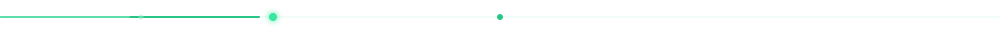
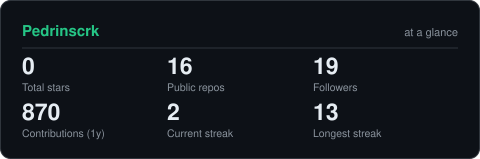
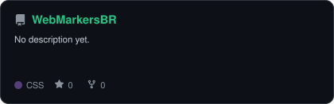
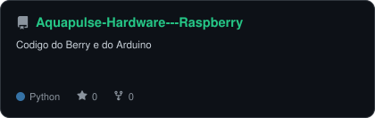
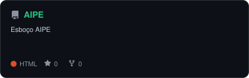
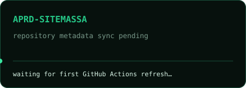

<div align="center">

<picture>
  <source media="(prefers-color-scheme: dark)" srcset="assets/portrait-dark.svg">
  <source media="(prefers-color-scheme: light)" srcset="assets/portrait-light.svg">
  
</picture>

<br>



<br>

<a href="https://github.com/Pedrinscrk">
  
</a>

<br>


</div>



## `~/` whoami

```console
$ cat about.txt
```

Developer focused on **backend, data and automation**.
I build APIs, web systems and data-driven workflows with an emphasis on reliability, clarity and measurable results.

```console
$ stack --core
> JavaScript  Node.js  Express  SQL Server  Redis  Git  REST APIs  Web
```

<div align="center">



## `~/` toolbox


<br>


</div>


<div align="center">

## `~/` language radar

<picture>
  <source media="(prefers-color-scheme: dark)" srcset="assets/radar-langs-dark.svg">
  <source media="(prefers-color-scheme: light)" srcset="assets/radar-langs-light.svg">
  
</picture>

</div>

---

<div align="center">

## `~/` contribution engine


<br><br>

<picture>
  <source media="(prefers-color-scheme: dark)" srcset="assets/snake-dark.svg">
  <source media="(prefers-color-scheme: light)" srcset="assets/snake.svg">
  
</picture>

</div>

---

<div align="center">

## `~/` coding rhythm



</div>

---

<div align="center">

## `~/` the numbers

<picture>
  <source media="(prefers-color-scheme: dark)" srcset="assets/card-stats-dark.svg">
  <source media="(prefers-color-scheme: light)" srcset="assets/card-stats-light.svg">
  
</picture>

<br><br>


</div>


<div align="center">

## `~/` selected work

<table>
<tr>
<td width="50%"><a href="https://github.com/Pedrinscrk/WebMarkersBR"><picture><source media="(prefers-color-scheme: dark)" srcset="assets/card-WebMarkersBR-dark.svg"><source media="(prefers-color-scheme: light)" srcset="assets/card-WebMarkersBR-light.svg"></picture></a></td>
<td width="50%"><a href="https://github.com/Pedrinscrk/Aquapulse-Hardware---Raspberry"><picture><source media="(prefers-color-scheme: dark)" srcset="assets/card-Aquapulse-Hardware---Raspberry-dark.svg"><source media="(prefers-color-scheme: light)" srcset="assets/card-Aquapulse-Hardware---Raspberry-light.svg"></picture></a></td>
</tr>
<tr>
<td width="50%"><a href="https://github.com/Pedrinscrk/AIPE"><picture><source media="(prefers-color-scheme: dark)" srcset="assets/card-AIPE-dark.svg"><source media="(prefers-color-scheme: light)" srcset="assets/card-AIPE-light.svg"></picture></a></td>
<td width="50%"><a href="https://github.com/Pedrinscrk/APRD-SiteMassa"><picture><source media="(prefers-color-scheme: dark)" srcset="assets/card-APRD-SiteMassa-dark.svg"><source media="(prefers-color-scheme: light)" srcset="assets/card-APRD-SiteMassa-light.svg"></picture></a></td>
</tr>
</table>

<br>

<sub>`01000010 01010101 01001001 01001100 01000100 · 01001101 01000101 01000001 01010011 01010101 01010010 01000101 · 01010011 01001000 01001001 01010000`</sub>

</div>
